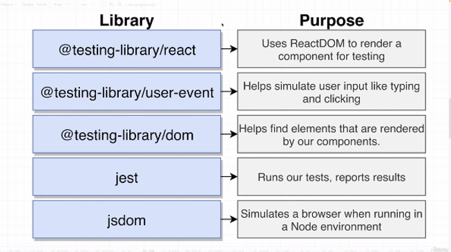
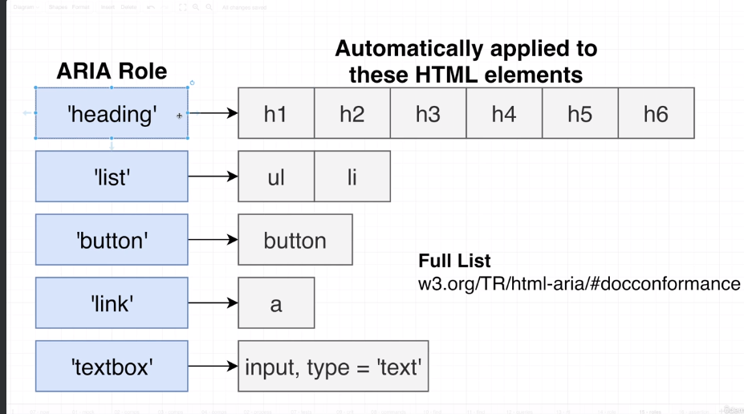
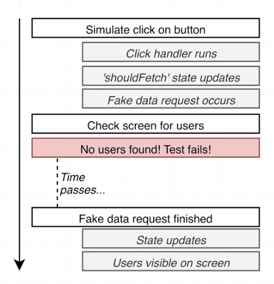
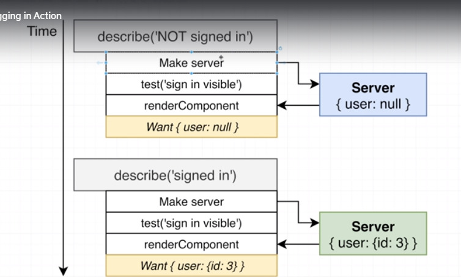

# React Testing Library and Jest: The Complete Guide

- course commenced 6/11/23 - 20:27pm.

---

## Section 1: Dive In - Let's Get Started!

### 1. How to Get Help

- just intro

---

### 2. Join Our Community!

- intro stuff

---

---

### 3. Start Testing... Now!

- [basic start project](http://www.codesandbox.io/s/rtl-starter-sq54b4 "starter project where we can start writing tests straight away")
- outline core functionality of the app
  - app starts up
  - 6 products visible
  - click load more button
  - 12 products visible
- test 1
  - when app starts, we see six products
- test 2
  - if we click load more, we see 12 products
- steps
  - create App.test.js in src
    - our App.test.js:

```js
import { render, screen, waitFor } from "@testing-library/react";
import user from "@testing-library/user-event";
import App from "./App";

test("shows 6 products by default", async () => {
  render(<App />);
  const headings = await screen.findAllByRole("heading");
  expect(headings).toHaveLength(6);
});
test("clicking on the button loads 6 more products", async () => {
  render(<App />);

  const button = await screen.findByRole("button", {
    name: /load more/i,
  });
  await user.click(button);
  await waitFor(async () => {
    const headings = await screen.findAllByRole("heading");
    expect(headings).toHaveLength(12);
  });
});
```

- to run the tests in codesandbox, click the 'tests' tab above the preview window
  - tests will run automatically or you can click on the play button
  - testing in codesandbox is buggy so you may have to refresh the page to get it to work
  - both of the tests pass

---

---

### 4. A few critical questions

- What were all those import statements?
- How were our tests found?
- What did all the testing code do?



- @testing-library/react
  - takes component and renders it
  - uses ReactDOM
- user-event
  - simulate user input
- @testing-library/dom
  - automatically included in our project by testing-library/react
  - helps us find our elements
- jest

- how were our tests found?
  - Jest finds files in the src folder that
    - end with .spec.js
    - end with .test.js
    - are placed in a folder called `__test__`
    - they just have to satisfy one of these criteria
    - it assumes they contain tests
      - jest will automatically execute them
- what did the testing code do?
  - we call the builtin 'test' function
    - describes the test and calls a callback function that contains testing code
    - `render(<App/>)` renders the app component
    - used `screen` to find all elements that have the `heading` role
      - find out more about roles later
    - `expect(headings).toHaveLength(6)` - there should be 6 headings
      - anything other than 6 fails the test

---

## Section 2: A Whirlwind Overview of Testing

### 5. Project Setup

- what we'll do now
  - make a simple project and test it
- later
  - we'll look at a large prebuilt project with complex features, and we'll test and add new features
- the simple project
  - form where user can enter in information (name, email)
  - the user can click submit and the details are added to a list of users
- Stephen is using create-react-app

  - I'll try to follow along with Vite
  - create a new vite React project called 'users'

---

### 6. Quick Note

- filler

---

### 7. Adding the Form

- see lesson 10 - completed users project

---

### 8. Handling User Input

- see lesson 10 - completed users project

---

### 9. Rendering the List of users

- see lesson 10 - completed users project

---

### 10. Completed Users Project

- link to download what we built in lessons 7-9

---

### 11. Our first test

- Test writing process

  - Pick out one component to test by itself
  - make a test file for the component if one does not exist
  - decide what the important parts of the component are
  - write a test to make sure each part works as expected
  - run tests at the command line

  - test UserForm.jsx
    - create UserForm.test.js
    - important parts are:
      - show two inputs and one button
      - entering a name and email and submitting causes onUserAdd to be called

- tests have a similar format
  - render the component
  - manipulate the component (simulate typing, etc)
  - assertion - make sure it's doing what we expect it to
- our UserForm.test.js looks like this:

```js
import { render, screen } from "@testing-library/react";
import { user } from "@testing-library/user-event";
import UserForm from "./UserForm";

test("it shows two inputs and a button", async () => {
  // render the component
  render(<UserForm />);

  // manipulate the component or find an element in it
  const inputs = screen.getAllByRole("textbox");
  const button = screen.getByRole("button");

  // Assertion - make sure component is doing what we expect it to do
  expect(inputs).toHaveLength(2);
  expect(button).toBeInTheDocument();
});
```

- incidentally, [this](https://zaferayan.medium.com/how-to-setup-jest-and-react-testing-library-in-vite-project-2600f2d04bdd "perfect guide for adding jest to a Vite react project") guide 100% works for adding Jest to a new Vite react project
- running our tests with `npm run test` we get:

```js
> users@0.0.0 test
> jest

 PASS  src/components/UserForm.test.js
  √ it shows two inputs and a button (127 ms)

Test Suites: 1 passed, 1 total
Tests:       1 passed, 1 total
Snapshots:   0 total
Time:        3.201 s
Ran all test suites.
```

---

### 12. Element Query System

- what happens when we run our tests?

  - executed in NodeJS environment
    - fake browser environment with `render()` with JSDOM
  - can manipulate or select elements using `screen` from rtl

- important part of testing is finding the elements that our component has created
  - test form submission
    - must find the button to click
  - test navigation
    - find a link to click
  - make sure element is visible
    - need to find the element
- system to find elements is tedious to use
- we use query functions to find elements we have rendered
- React Testing Library Query System provides approx 48 query functions
  - getByRole()
  - findAllByDisplayValue()
  - queryAllByRole()
  - queryByRole()
  - findByRole()
  - queryByLabelText()
  - findAllByTitle()
  - findByTitle()
  - getByLabelText()
- the names of the functions have a lot of meaning in terms of which to use when

---

### 13. Understanding ARIA roles

- getAllByRole and getByRole
- role refers too ARIA roles
  - they clarify the purpose of html element
  - traditionally used by screen readers
  - many html elements have implicit/automatically assigned roles
  - elements can be manually assigned a role
  - implicit assignment:
    
- this ARIA role system is the preferred way of finding elements that have been rendered by our components
  - RTL pushes you in this direction
  - this means we need to understand ARIA role system

---

### 14. Understanding Jest matchers

- this refers to assertions which are our `expect()` functions
- expect is provided by Jest
- matchers are typically chained on our expect assertion like so:

```js
expect(inputs).toHaveLength(2);
```

- `toHaveLength` is a matcher
- there are Jest matchers and RTL matchers
- some Jest matchers
  - toHaveLength
  - toEqual
  - toContain
  - toThrow
  - toHaveBeenCalled
- some RTL matchers
  - toBeInTheDocument
  - toBeEnabled
  - toHaveClass
  - toHaveTextContent
  - toHaveValue
- Jest matchers are general purpose, can test any javascript
  - full list of jest matchers [here](https://jestjs.io/docs/expect "list of jest expect matchers")
- RTL matchers
  - jest-dom provides these extra matchers
  - more concerned with DOM elements
    - is present
    - has text, has attribute, etc
- a full list of RTL jest-dom matchers is available [here](https://github.com/testing-library/jest-dom#custom-matchers "a list of jest-dom custom matchers on github")

---

### 15. Test was not wrapped in act(...) warning and test failure

- a quick note about warnings related to act(...). This relates to RTL v14 update and CRA not updating its version of RTL.
- user events are now async
  - just have to make the test callback async and use await a bunch

---

### 16. Simulating User Events

- we're testing we can enter a name and email and click submit and then the onUserAdd function gets called
- we'll write a bad implementation of the test that works and fix it later
  - there are many different ways to write tests
  - one way might be better than another way
- to simulate clicks and keyboard entry we use the `user` object from RTL

```js
user.click(element);
user.keyboard("asdf");
user.keyboard("{Enter}");
```

---

### 17. Recording function calls

- it's easier to interpret results in the terminal if we just run one test file at a time sometimes
- run a single test in Jest:
- you can `npm i -g jest-cli` and then run `jest Component.test.js`
- if we run our tests, we'll get an error that states that onUserAdd is not defined
  - remember, this is the prop being passed to UserForm from App.jsx
  - since we are testing UserForm standalone, there is no prop or App.jsx for that matter!
- one way to fix this is to add an empty arrow function as follows:

```js
render(<UserForm onUserAdd={() => {}} />);
```

- the purpose of this test is to make sure it gets called, and called with the correct name and email, so this approach makes the error go away but isn't a good test
- how can we do this (badly for now)?
  - above our `render()` we define a new function and declare an array

```js
const argList = [];
const callBack = (...args) => {
  argList.push(args);
};
```

- now, when we submit our form, we can use argList to verify that our function was called and it was called with appropriate arguments
- like so:

```js
expect(argList).toHaveLength(1); // our callback got called at least one time
expect(argList[0][0]).toEqual({ name: "gavan", email: "gavan@email.com" });
```

- running our test we do actually get the `act(...)` warning
  - must update to v14 of rtl
- running our tests again, we get:

```js
 PASS  src/components/UserForm.test.js
  √ it shows two inputs and a button (131 ms)
  √ it calls onUserAdd when form is submitted (544 ms)

Test Suites: 1 passed, 1 total
Tests:       2 passed, 2 total
Snapshots:   0 total
Time:        3.306 s, estimated 4 s
Ran all test suites matching /userform.test.js/i.
```

- our tests are working, but it's not the best implementation and we'll address this later
- our UserForm.test.js so far:

```js
import { render, screen } from "@testing-library/react";
import user from "@testing-library/user-event";
import UserForm from "./UserForm";

test("it shows two inputs and a button", async () => {
  // render the component
  render(<UserForm />);

  // manipulate the component or find an element in it
  const inputs = screen.getAllByRole("textbox");
  const button = screen.getByRole("button");

  // Assertion - make sure component is doing what we expect it to do
  expect(inputs).toHaveLength(2);
  expect(button).toBeInTheDocument();
});

test("it calls onUserAdd when form is submitted", async () => {
  // not the best implementation
  const argList = [];
  const callBack = (...args) => {
    argList.push(args);
  };
  // try to render my component
  render(<UserForm onUserAdd={callBack} />);

  // find the two inputs
  const [nameInput, emailInput] = screen.getAllByRole("textbox");

  // simulate typing in a name
  await user.click(nameInput);
  await user.keyboard("gavan");

  // simulate typing in an email
  await user.click(emailInput);
  await user.keyboard("gavan@email.com");

  // find the button
  const button = screen.getByRole("button");

  // simulate clicking the button to submit the form
  user.click(button);

  // assertion to make sure 'onUserAdd' gets called with email and name
});
```

---

### 18 Introducing Mock Function

- we're fixing up our previous test implementation here
- argList and the callback are a hacky way to test that our function is called and called with correct args
- Jest has a tool to check just this scenario (function is called with correct args)
  - mock functions
- mock function
  - fake function that doesn't do anything
  - records when it gets called and the args it was called with
  - used very often when we need to make sure a component calls a callback
- steps
  - we create a mock function
  - we pass it down as onUserAdd prop to UserForm
  - mock func will have internal storage
    - will record how many times called
    - different args it receives when called
    - we'll simulate form submission
    - our mock func will get called
      - mock func will store arg it received
      - increase counter to record how many times called
      - we can write assertions about number of times called and args etc
- delete arg list and callback
- create a mock function like so:

```js
const mock = jest.fn();
```

- mock is now a function
- we pass it down to our component:

```js
render(<UserForm onUserAdd={mock} />);
```

- jest has builtin matchers for checking mock functions

```js
expect(mock).toHaveBeenCalled();
expect(mock).toHaveBeenCalledWith({ name: "gavan", email: "gavan@email.com" });
```

- running our tests, all pass
  - we had to stick await in front of our `user.click(button)`
- side note
  - installed nvm to let us update node and npm from the command line going forward

---

### 19. Querying elements by labels

- the next issue is:

```js
// find the two inputs
const [nameInput, emailInput] = screen.getAllByRole("textbox");
```

- we're assuming there will be only two inputs
  - we might reorder the inputs, in which case nameInput will reference the email input in the DOM
  - we might add or remove inputs
- any changes to our UserForm might make our tests begin to fail
  - this test is brittle - easy to break
    - changes will cause the test to fail even though the component may be working correctly
- a better way
  - need to understand forms, labels and inputs better
  - basic html stuff
    - if a label's 'for' attribute matches an input's 'id,' clicking on the label will focus the input
- if we make sure our label has a 'htmlFor' and the input has a matching id then we can:

```js
screen.getByLabelText(/enter email/i);
screen.getByRole("textbox", { name: /enter email/i });
```

- getByRole is using a filter object with regular expression to match the label text
- rtl prefers or recommends roles
- updating our test:

```js
// find the two inputs
const nameInput = screen.getByRole("textbox", { name: /enter name/i });
const emailInput = screen.getByRole("textbox", { name: /enter email/i });
```

- more flexible
- we can change order or add more inputs and tests won't break

---

### 20. Testing UserList

- receives array of users each with name and email
- renders table row, 2 data cells for every user
- important parts of this component?
  - shows one line per user
  - shows correct name and email for each user
- our code so far

```js
import { render, screen } from "@testing-library/react";
import UserList from "./UserList";

test("render one row per user", async () => {
  // render the component
  const users = [
    { name: "gavan", email: "gavan@email.com" },
    { name: "sam", email: "sam@email.com" },
  ];
  render(<UserList users={users} />);
  // find the rows

  // assertion: correct number of rows in the table
});

test("render the name and email of each user", async () => {
  render(<UserList />);
});
```

- how do we work out what the best way to find our rows is?

---

### 21. Getting Help with query functions

- memorizing query functions to find elements is hard
- can use this helper function:

```js
screen.logTestingPlaygroundURL();
```

- this creates html rendered by your component and creates a link to view the html in the testing playground tool
  - helps you to write queries - functions to find elements
- adding this to our test file and running we get:

```js
https://testing-playground.com/#markup=DwEwlgbgfMAuCGAjANgUwAQGNnwM64F4AiXTAWkRADsBPAMQAt0ArAVwEUAFAaQGEiYsBqnghBAJ0EMoAOXgBbVMAD0QqVACi8+GGQq1+yfuGjBiAPYgaEwWIDm8CPCr6xce4+cABVNt0A6THN5VxhVI1gIsVwFUPcoGPkfP2RA4LjwsNgLKyykNDDwaCA
```

- the long string represents html generated by component in enccoded format
- Testing Playground notes
  - terminal on left has querySelector code that will probably work to select ouru element 100% of the time
  - suggested query on right is green or blue and it may or may not be possible to use it directly as suggested
  - another downside, we are trying to find the rows but we can't click on the row, only the cells
    - can add custom styling to the html directly in top-left panel
    - add padding, and will be easier to click
- add this inline to the element you want to click on and find

```js
style = "border: 10px solid red; display: block;";
```

- our find and assertion:

```js
const rows = screen.getAllByRole("row");

// assertion: correct number of rows in the table
expect(rows).toHaveLength(2);
```

- however, there's a header row, so we fail the test

---

### 22 Query Function escape hatches

- it may not be possible to find only the elements we need solely using ARIA roles
- fallbacks (escape hatch) when role doesn't work that well
  - data-testid
  - container.querySelector()
- using data-testid
  - we add a `data-testid` attribute to our actual component
  - UserList.jsx:

```js
return (
  <Wrapper>
    <thead>
      <tr>
        <th>Name</th>
        <th>Email</th>
      </tr>
    </thead>
    <tbody data-testid="users">{renderedUsers}</tbody>
  </Wrapper>
);
```

- add `within` to our test file:

```js
import { render, screen, within } from "@testing-library/react";
```

- update the query:

```js
// find the rows
const rows = within(screen.getByTestId("users")).getAllByRole("row");
```

- adding data-testid to our element means we can find it in our test
- when we find it, then we can find elements within it that match our role
- we're modifying the component purely to test it
  - not necessarily a great solution

---

### 23. Another query function fallback

- `container.querySelector()`
- when we call `render()` we get back an obj that has helper properties
  - one of these is `container`
  - so we can destructure:

```js
const { container } = render(<UserList users={users} />);
```

- container is a ref to a html element auto added into our component
- you can see this extra element in Testing Playground, there is an extra outer div element added
- we can do this:

```js
// find the rows
const rows = container.querySelectorAll("tbody tr");
```

- note, data-testid is more preferred

---

### 24. Testing Table Contents

- find the cells and make sure the data is appearing on screen:

```js
test("render the name and email of each user", () => {
  const users = [
    { name: "gavan", email: "gavan@email.com" },
    { name: "sam", email: "sam@email.com" },
  ];
  // render
  render(<UserList users={users} />);
  // find
  for (let user of users) {
    const name = screen.getByRole("cell", { name: user.name });
    const email = screen.getByRole("cell", { name: user.email });
    expect(name).toBeInTheDocument();
    expect(email).toBeInTheDocument();
  }
});
```

---

### 25. Avoiding BeforeEach

- we have two tests in UserList and both tests share code. They both declare a list of users and render a component
- we can extract the duplicate code into a helper function
- the helper function:

```js
const renderComponent = () => {
  // render the component
  const users = [
    { name: "gavan", email: "gavan@email.com" },
    { name: "sam", email: "sam@email.com" },
  ];
  render(<UserList users={users} />);
  return { users };
};
```

- we can now call this in each test
- Jest provides a `beforeEach()` function that you can use for this
  - you will get a warning if you try to render a component inside of a beforeEach
  - RTL prefers writing fns like renderComponent instead
- complete UserList.test.js:

```js
import { render, screen, within } from "@testing-library/react";
import UserList from "./UserList";

const renderComponent = () => {
  // render the component
  const users = [
    { name: "gavan", email: "gavan@email.com" },
    { name: "sam", email: "sam@email.com" },
  ];
  render(<UserList users={users} />);
  return { users };
};

test("render one row per user", () => {
  renderComponent();
  // render the component

  // find the rows
  const rows = within(screen.getByTestId("users")).getAllByRole("row");

  // assertion: correct number of rows in the table
  expect(rows).toHaveLength(2);
});

test("render the name and email of each user", () => {
  const { users } = renderComponent();
  // find
  for (let user of users) {
    const name = screen.getByRole("cell", { name: user.name });
    const email = screen.getByRole("cell", { name: user.email });
    expect(name).toBeInTheDocument();
    expect(email).toBeInTheDocument();
  }
});
```

---

### 26. Testing the whole app

- now we test App.jsx
- create App.test.js
- we use `screen.debug()` here which prints our html out to the terminal

```js
<body>
  <div>
    <form>
      <div>
        <label for="name">Enter name</label>
        <input id="name" type="text" value="jane" />
      </div>
      <div>
        <label for="email">Enter email</label>
        <input id="email" type="email" value="jane@email.com" />
      </div>
      <button>Add User</button>
    </form>
    <hr />
    <table class="sc-bdnyFh juQPKC">
      <thead>
        <tr>
          <th>Name</th>
          <th>Email</th>
        </tr>
      </thead>
      <tbody data-testid="users">
        <tr>
          <td>jane</td>
          <td>jane@email.com</td>
        </tr>
      </tbody>
    </table>
  </div>
</body>
```

- this allows us to see that we are going down the right path
  - we have selected the inputs, entered text, clicked the submit button and our user is being rendered to the screen
- our complete App.test.js file:

```js
import { render, screen } from "@testing-library/react";
import userEvent from "@testing-library/user-event";
import App from "./App.jsx";

test("can receive a new user and show it on a list", async () => {
  // render the component
  render(<App />);
  // find input for name and email and find button

  const nameInput = screen.getByRole("textbox", { name: /enter name/i });
  const emailInput = screen.getByRole("textbox", { name: /enter email/i });
  const button = screen.getByRole("button");

  // enter text in the inputs
  await userEvent.click(nameInput);
  await userEvent.keyboard("jane");
  await userEvent.click(emailInput);
  await userEvent.keyboard("jane@email.com");

  // find submit button and click it
  await userEvent.click(button);

  // make sure we can find new name and email in the table
  const name = screen.getByRole("cell", { name: "jane" });
  const email = screen.getByRole("cell", { name: "jane@email.com" });
  // assertions
  expect(name).toBeInTheDocument();
  expect(email).toBeInTheDocument();
});
```

---

### 27. A touch of test-driven development

- when we submit our form, our inputs should 'empty out' or be set to empty strings
- we will write the test to make sure this is happening first, and then we will write the code to make it happen (test-driven)
- since this has to do with the form state, we can add a test to UserForm.test.js
- since we're rendering UserForm, it expects an onUserAdd
  - we've already tested that this onUserAdd callback is run with correct args
  - in this case we don't care that it is called
  - therefore, we can simply provide an empty callback:
  ```js
  render(<UserForm onUserAdd={() => {}} />);
  ```
- interestingly, we duplicate a lot of code here. here is the new test in UserForm.test.js:

```js
test("our name and email input fields should be set to empty strings after the form has been submitted", async () => {
  render(<UserForm onUserAdd={() => {}} />);

  const nameInput = screen.getByRole("textbox", { name: /enter name/i });
  const emailInput = screen.getByRole("textbox", { name: /enter email/i });
  const button = screen.getByRole("button");

  await userEvent.click(nameInput);
  await userEvent.keyboard("jane");
  await userEvent.click(emailInput);
  await userEvent.keyboard("jane@email.com");

  await userEvent.click(button);

  expect(nameInput).toHaveValue("");
  expect(emailInput).toHaveValue("");
});
```

- update our UserForm to clear the values/state
  - our new test passes!

---

### 28. Feature Implementation

- did this above, two state setters!

---

### 29. Introducing RTL Book

- rtl book is a CLI interactive cheat sheet for query functions and matchers `rtl-book`
- running rtl-book:

```js
npx rtl-book serve roles-notes.js
```

- roles-notes is just a name we give to a file that will be created by running the command
- running the command creates a new file called roles-notes.js and saves notes in there
  - we can then view in the browser
- rtl-book is actually pretty cool
  - it's an interactive code env with links to docs for various libraries/testing frameworks

---

## Section 3: Understanding Element Roles

### 30. A few notes on RTL Book

- close with ctrl+c
- open it again using `npx rtl-book serve roles-notes.js`
- the order of the code cells matters
  - you define a component in a cell
  - you can test it in a cell further down, but not vice-versa
  - in RTL Book we can run render to show the component in a preview window - it doesn't have to be only run in a test

---

### 31 partial rule list

- we create a component in RTL book and render it

```js
const RoleExample = () => {
  return (
    <div>
      <a href="/">Link</a>
      <button>button</button>
      <footer>content info</footer>
      <h1>heading</h1>
      <header>banner</header>
       Img
      <input type="checkbox" /> Checkbox
      <input type="number" /> Spinbutton
      <input type="radio" /> Radio
      <input type="text" /> Textbox
      <li>list item</li>
      <ul>listgroup</ul>
    </div>
  );
};

render(<RoleExample />);
```

---

### 32 finding elements by role

- we write a test in RTL book:

```js
test("can find element by role", async () => {
  // render the component
  render(<RoleExample />);
  const roles = [
    "link",
    "button",
    "contentinfo",
    "heading",
    "banner",
    "img",
    "checkbox",
    "spinbutton",
    "radio",
    "textbox",
    "listitem",
    "listgroup",
  ];
  for (let role of roles) {
    const element = screen.getByRole(role);
    expect(element).toBeInTheDocument();
  }
});
```

- purpose is to see how we can find various elements by role
- listgroup fails because the actual element role is 'list'
- some roles are less obvious:

  - contentinfo = footer
  - banner = header
  - spinbutton = input with a type of number

  ***

### 33. finding by accessible names

- how do you find a single element when there are two or more elements with the same roles?
- you can use accessible name
- not all elements have accessible names
  - inputs are self-closing and don't have text inside
  - the accessible name is the text inside the element

```js
<button>click</button>
```

- the word 'click' is the accessible name of the button above
- to select or find a button with text submit:

```js
test("can select by accessible name", async () => {
  // render the component
  render(<AccessibleName />);
  const submitButton = screen.getByRole("button", { name: "submit" });
});
```

- better to often use a regular expression

```js
test("can select by accessible name", async () => {
  // render the component
  render(<AccessibleName />);
  const submitButton = screen.getByRole("button", { name: /submit/i });
});
```

- finding two buttons with different accessible names:

```js
test("can select by accessible name", async () => {
  // render the component
  render(<AccessibleName />);
  const submitButton = screen.getByRole("button", { name: /submit/i });
  const cancelButton = screen.getByRole("button", { name: /cancel/ });
  expect(submitButton).toBeInTheDocument();
  expect(cancelButton).toBeInTheDocument();
});
```

### 34. Linking inputs to labels

- in some cases, inputs, there is no text in between.
- we can use accessible names with inputs by adding a label
- component to test:

```js
const MoreNames = () => {
  return (
    <div>
      <label>Email</label>
      <input type="text" id="email" />
      <label>Search</label>
      <input type="text" />
    </div>
  );
};

render(<MoreNames />);
```

- test:

```js
const emailInput = screen.getByRole("textbox", { name: /email/i });
```

- fails because there is no link between the label and the input
- we need to use `htmlFor` and `id`

```js
   <label htmlFor="email">Email</label>
      <input type="text" id="email" />
```

- and assertions:

```js
expect(emailInput).toBeInTheDocument();
expect(searchInput).toBeInTheDocument();
```

- and it works

---

### 35. Directly Assigning an Accessible Name

- example where this would be useful is a button that wraps an icon
  - there is no accessible text

```js
      <button>
        <svg />
      </button>
      <button>
        <svg />
      </button>
```

- we can add `aria-label="ourName"` to our element

```js
      <button aria-label="sign in">
        <svg />
      </button>
      <button aria-label="sign out">
        <svg />
      </button>
```

- and so the following passes:

```js
test("find element based on label", () => {
  render(<IconButtons />);

  const buttonOne = screen.getByRole("button", { name: /sign in/i });
  const buttonTwo = screen.getByRole("button", { name: /sign out/i });
  expect(buttonOne).toBeInTheDocument();
  expect(buttonTwo).toBeInTheDocument();
});
```

### 36. Completed Roles Notebook

- just a link to download complete roles-notes with comments by Stephen

### 37 Deeper into query functions

- function names indicate various things
- query functions always start with one of the following:
  - getBy
  - getAllBy
  - queryBy
  - queryAllBy
  - findBy
  - findAllBy
- single element
  - getBy throws if not 1 match
  - queryBy
    - return null if no match
    - throws if more than 1 match
  - findBy
    - throws if more/less than one element
    - looks for element over span of 1 second (is asynchronous)
- multiple elements
  | name | 0 matches | 1 match | > 1 match | notes |
  | ---- | -------- | ------- | --------- | ----- |
  | getAllBy | Throw | []Element | []Element | |
  | queryAllBy | [] | []Element | []Element | |
  | findAllBy | Throw | []Element | []Element | Async - over 1 second |

- when to use each type of query
  | goal of test | Use |
  | ------------ | --- |
  | prove element exists | getBy, getAllBy |
  | prove element does not exist | queryBy, queryAllBy |
  | make sure element eventually exists | findBy, findAllBy |

---

## Section 4: Finding Elements with Query Functions

### 38. getBy, queryBy, findBy

- here we explore using getBy, findBy and queryBy

```js
const ColorList = () => {
  return (
    <ul>
      <li>red</li>

      <li>blue</li>
      <li>green</li>
    </ul>
  );
};

render(<ColorList />);
```

- how do these methods behave when we find 0 elements?

```js
import { render, screen } from "@testing-library/react";

test("", async () => {
  // render the ColorList
  render(<ColorList />);
  expect(() => {
    screen.getByRole("textbox").toThrow();
  });
});
```

- this test passes, because we expect getByRole to throw an error when it finds 0 elements

```js
expect(screen.queryByRole("textbox")).toEqual(null);
```

- this test assumes queryByRole finds 0 elements and this will return null, so the test passes
- findByRole is a little more tricky

```js
let errorThrown = false;
try {
  await screen.findByRole("textbox");
} catch (err) {
  errorThrown = true;
}
expect(errorThrown).toEqual(true);
```

- Stephen says this is a workaround regarding confirming an async test throws in 'this browser environment'
  - not sure if he means his rtl-book application, or just jest/rtl in general

### 39. More on single queries

- here we explore what happens when findBy, queryBy, and getBy find 1 element and multiple elements
- remember, these are queries for finding single elements
- tests pass when finding one element:

```js
expect(screen.getByRole("list")).toBeInTheDocument();
expect(screen.queryByRole("list")).toBeInTheDocument();
expect(await screen.findByRole("list")).toBeInTheDocument();
```

- if any of the single queries finds more than one element, we expect them to throw

```js
expect(() => {
  screen.getByRole("listitem");
}).toThrow();

expect(() => {
  screen.queryByRole("listitem");
}).toThrow();

let errorThrown = false;
try {
  await screen.findByRole("listitem");
} catch (err) {
  errorThrown = true;
}
expect(errorThrown).toEqual(true);
```

### 40. Multiple element variations

- intentionally looking for multiple elements
- our tests:

```js
test("getAllBy, queryAllBy, findAllBy ", async () => {
  // render the ColorList
  render(<ColorList />);

  expect(screen.getAllByRole("listitem")).toHaveLength(3);
  expect(screen.queryAllByRole("listitem")).toHaveLength(3);
  expect(await screen.queryAllByRole("listitem")).toHaveLength(3);
});
```

- getAllBy and findAllBy will throw if you find 0 elements
- queryAllBy returns empty array if zero found

### 42. When to use These Queries

- when to Use
  | goal of test | Use |
  | ------------ | --- |
  | prove element exists | getBy, getAllBy |
  | prove element does not exist | queryBy, queryAllBy |
  | make sure element eventually exists | findBy, findAllBy |
- if getByRole finds 0 elements, it throws an error and the test fails
  - any later assertion is not executed (it's pointless), since getByRole throws an error and later code is not executed
- we should not, however, write tests that skip the assertion using just screen.getByRole
  - if later on you or someone else changes the getByRole to queryByRole, the test will pass as there is no assertion
- our test:

```js
const element = screen.getByRole("list");
expect(element).toBeInTheDocument();
```

- using queryByRole to prove an element does not exist
  - it returns null and does not throw if number of elements is zero
- our test:

```js
const element = screen.queryByRole("textbox");
expect(element).not.toBeInTheDocument();
```

- using findBy to make sure element eventually exists
  - used with data fetching

### 43. When to use async queries

- we'll fake a data request here and use findBy
- we'll also show how tests fail with synchronous tests
- our new component to test data fetching

```js
import { useState, useEffect } from "react";

const fakeFetchColors = () => {
  return Promise.resolve(["red", "green", "blue"]);
};

const LoadableColorList = () => {
  const [colors, setColors] = useState([]);

  useEffect(async () => {
    setColors(await fakeFetchColors());
  }, []);

  const renderedColors = colors.map((color) => {
    return <li key={color}>{color}</li>;
  });

  return <ul>{renderedColors}</ul>;
};

render(<LoadableColorList />);
```

- testing the wrong way with getAllBy

```js
const elements = screen.getAllByRole("listitem");
expect(elements).toHaveLength(3);
```

- this synchronous test fails
- the right way to test data fetching (passing test)

```js
const elements = await screen.findAllByRole("listitem");
expect(elements).toHaveLength(3);
```

---

### 44. Completed Queries Notebook

- just a link to the completed queries notebook

---

## Section 5: Query Function Suffixes

### 45. Query Criteria

- create a new rtl notebook called criteria-notebook.js
- this relates to the end of the query function name
  - getByRole
  - getByLabelText
  - byPlaceholderText
  - byText
  - ByDisplayValue
  - byAltText
  - ByTitle
  - ByTestId
- when to use each?
  - we always prefer ByRole
  - then fall back to using one of the others
    - byTestId is one of our last fall backs
- our component to test:

```js
import { screen, render } from "@testing-library/react";
import { useState } from "react";

function DataForm() {
  const [email, setEmail] = useState("asdf@asdf.com");
  return (
    <form>
      <h3>enter data</h3>
      <div data-testid="image wrapper">
        
      </div>
      <label htmlFor="email">email</label>
      <input
        id="email"
        value={email}
        onChange={(e) => setEmail(e.target.value)}
      />
      <label htmlFor="color">color</label>
      <input id="color" placeholder="Red" />
      <button title="Click when ready to submit">Submit</button>
    </form>
  );
}

render(<DataForm />);
```

- our skeleton test:

```js
import { render, screen } from "@testing-library/react";

test("selecting different elements", async () => {
  render(<DataForm />);
  const elements = [];

  for (let element of elements) {
    expect(element).toBeInTheDocument();
  }
});
```

### 46. When To Use Each Suffix

- we use all the getBy variations of these suffixes
- our tests:

```js
import { render, screen } from "@testing-library/react";

test("selecting different elements", async () => {
  render(<DataForm />);
  const elements = [
    screen.getByRole("button"),
    screen.getByLabelText(/email/i),
    screen.getByPlaceholderText("Red"),
    screen.getByText("enter data"),
    screen.getByDisplayValue("asdf@asdf.com"),
    screen.getByAltText("data"),
    screen.getByTitle("Click when ready to submit"),
    screen.getByTestId("image wrapper"),
  ];

  for (let element of elements) {
    expect(element).toBeInTheDocument();
  }
});
```

- note, for getByLabelText we could have done:

```js
screen.getByRole("textbox", { name: /email/i });
```

- this achieves the same thing
- getByText is also very useful
  - find text, don't necessarily care what element it is in
- byTestId is the ultimate fallback
- you can substitute regular expressions for any string

---

### 47. Completed Criteria Notebook

- just a link to the completed criteria notebook that we've been working on

---

## Section 6: Matchers in Jest

### 48. Diving Into Matchers

- matchers help make sure a value is what we expect it to be
- we have access to Jest matchers and all matchers in @testing-library/jest-dom
  - toBeInTheDocument()
- we will write custom matchers here
  - useful if writing tests that are very similar in nature
- in our note book, we create a FormData component that renders a form
  - to get a form element, you can't use getByRole
  - must assign aria label to it
- our component:

```js
import { render, screen, within } from "@testing-library/react";

const FormData = () => {
  return (
    <form aria-label="form">
      <button>save</button>
      <button>cancel</button>
    </form>
  );
};

render(<FormData />);
```

- our test:

```js
test("the form displays two buttons", async () => {
  render(<FormData />);

  expect(screen.getAllByRole("button")).toHaveLength(2);
});
```

- seems easy, but if we change our component it becomes more complex

---

### 49. Introducing Custom Matchers

- the change we make, we wrap our form with a div and add a button outside the form
- our test says "the form displays two buttons"
  - one of our buttons is outside the form
  - we could update the test, so we find the form and then find the buttons inside the form
- alternatively, we just look for all 3 buttons
- in this case, we will find the form and make sure it has two buttons
- we imported the `within` helper function
- updated test using `withing`:

```js
test("the form displays two buttons", async () => {
  render(<FormData />);

  const form = screen.getByRole("form");
  const buttons = within(form).getAllByRole("button");
  expect(buttons).toHaveLength(2);
});
```

- this was an easy fix
  - imagine working on a very large project where we have to write many, many tests like this and it becomes tedious
- one way to approach that is to write custom matcher which might look like this:

```js
expect(form).toContainRole("button", 2);
```

---

### 50. Implementing a Custom Matcher

- to create a custom matcher, we define a new function

```js
const toContainRole = (container, role, quantity = 1) => {};
```

- the container is what our `expect()` takes as an argument
- role is the role
- quantity is the number of elements we expect to find in the container and it has a default value of 1
- now we connect our `toContainRole` custom matcher to `expect` so that it can be treated as a matcher
- under the function definition we put:

```js
expect.extend({ toContainRole });
```

- we return an object from our custom matcher:

```js
return {
  pass: false,
  message: () => `the container did not contain 2 buttons`,
};
```

- if pass is false, we also have a message prop which is a function that returns a string
  - this string tells the developer why the test failed
- complete matcher code:

```js
const toContainRole = (container, role, quantity = 1) => {
  const elements = within(container).queryAllByRole(role);

  if (elements.length === quantity) {
    return {
      pass: true,
    };
  }
  return {
    pass: false,
    message: () =>
      `expected ${container} to have ${quantity} items with role ${role}. Found ${elements.length} instead.`,
  };
};
expect.extend({ toContainRole });
```

- usage of custom matcher:

```js
test("the form displays two buttons", async () => {
  render(<FormData />);

  const form = screen.getByRole("form");

  expect(form).toContainRole("button", 2);
});
```

---

## Section 7: Big Project Overview

### 51. Required Project Setup - Do Not Skip

- a link to resource required for upcoming lectures

### 52. App Overview and Setup

- we unzip resources
- navigate to folder
- install deps and `npm run start`
- also have to run `npx prisma generate` if server error
- this is an app that Stephen created for the course for testing/adding features and more testing
- the app allows you to search github repos and then get an english language explanation from an AI chatbot of what the code does
  - pretty damn cool!

## 53. The Tech in This Project

- we have a CRA application
  - for navigation it uses React Router
  - data fetching
    - SWR
      - takes data that has been fetched and serving or making available to components, coordination layer
      - SWR is a React Hooks library for data fetching. The name “SWR” is derived from stale-while-revalidate , a cache invalidation strategy popularized by HTTP RFC 5861. SWR first returns the data from cache (stale), then sends the request (revalidate), and finally comes with the up-to-date data again.
    - Axios
  - Express API
    - handles auth
    - stores data in a SQLite database
    - outside API hosted by Stephen
      - provides access to
        - Github API
        - Open AI API
- if we haven't heard of React Router or SWR or Axios - GOOD!
  - most testing is figuring out code other engineers have written

---

### 54. The Path Ahead

- plan of what we will do in testing the Codesplain application
- how people think testing works
  - write code
  - immediately write tests with perfect knowledge of the code
  - everything is super easy and works first time
- this is not what happens
- Testing in reality
  - user complains about a bug
  - support gives workaround
  - support tells project manager about the bug
  - project manager tells engineering manager the bug needs to be fixed
  - engineering manager tells you to fix it probably without a lot of detail
  - you need to find the bug, fix it, and write a test to confirm it is fixed
- The Plan Ahead
  - pretend to be engineers working on codesplain
  - we will receive bug reports that contain less info than might be useful - created by Stephen
  - figure out how to find the code and fix it
  - figure out how to write code to confirm the bug is fixed
  ***

### 55. A Process for Debugging

- typically in a real world situation a bug report might include:
  - a title with a brief description of the bug
  - steps to reproduce or experience the bug
  - expected outcome
  - actual outcome
  - screenshots
- The Bug Fixing Process
  - Find the relevant components in the codebase
  - Figure out how the component is getting its data/state/props
  - use a debugger, console log or documentation to understand the data
  - implement a fix
  - test the fix
- Finding Relevant Components
  - React Dev Tools
  - Search the codebase for text/icons/classnames that the component is producing
  - If error is being thrown, look at stack trace
  - ask another engineer
- note with React Dev Tools
  - you can click the arrow (similar to the hover to see element functionality provided by the browser), and hover over an element on the rendered page to see what component is producing it
  - i did not know this was a thing!
- it's possible to open up a file directly if you know its name in VSCode using `Ctrl+p` and typing the name of the file
- we know the component is rendering 'issues need help'
  - we can search for that string using `Ctrl Shift F`
- asking other engineers is a low priority
  - want to solve problems ourselves - I mean, that's the job

---

### 56. Understanding Data Flowing Into the Component

- figure out how the data is getting its props/data/stat
- we know it is the RepositorySummary component that is rendering the stuff we are interested in, in terms of our bug
- it's best to find your files through `ctrl P`
  - on larger projects, using the explorer will be time consuming and messy
- RepositorySummary is pretty simple
  - no state
  - no Redux or context
  - just one prop, which is `repository`
  - we're destructuring data from repository prop
    - stands to reason that the `repository` prop might also include info about the primary language
- a few ways to understand/find out about `repository`
  - console log
  - set a debugger
  - react developer tools
  - can look at network request log
    - figure out which request is seving up the info that the comp is using
    - look at raw request
    - understand what is being served
- console log
  - just `console.log(repository)`
    - Stephen searches for 'react' and scrolls through the results to find the language prop on repository
    - searching for python, we see that one item has a language of `null` while another is set to 'Python'
- set a debugger
  - we type `debugger;` in our code
  - if our dev console is open in browser, as our comp is executed, we'll stop execution at the debugger statement
  - can hit `esc` to open up console
  - now you can print out and work with the variables in the current scope
  - for example, typing out `repository` and hitting enter, will print out the current value of the repository prop
  - you can actually type `repository.language` and it will print out the value of that prop within repository!
  - remember to remove the debugger statement when done
- react developer tools
  - again, we can hover to show component that renders our html
  - we can see the props, expand, and find the language property
- network request log
  - filter by fetch/xhr
  - trigger a search by typing in the search bar
  - you may not be fetching if there is aggressive caching - may have to refresh page
  - there is a repositories request
  - you can inspect it on preview tab
    - again, can scroll down and find the language prop

---

### 57. Developing a Test and Fix

- writing a test for the comp, relies on the steps we went through in lesson 56
- understanding the repository object and what it contains is crucial to creating a good test
- our bug fix process says implement a fix and then test, but we'll reverse the order here, test and then fix
- need to create a test file for this component if it doesn't exist
  - right click on tab and `reveal in explorer view`
- we create a test file for it:

```js
import { screen, render } from "@testing-library/react";
import RepositoriesSummary from "./RepositoriesSummary";

test(`displays the primary language of the repository`, () => {
  const repository = {
    stargazers_count: 50,
    open_issues: 0,
    forks: 500,
    language: "JavaScript",
  };
  render(<RepositoriesSummary repository={repository} />);

  const language = screen.getByText("JavaScript");
  expect(language).toBeInTheDocument();
});
```

- our fix, note we destructure `language` from repository:

```js
<div>{language}</div>
```

- my questions about this are:
  - should we not double check that the language prop in repository is what we think it is? There's an assumption that it represents the primary language being used by the repository
  - there are also null values where the primary language is not set
  - what if there are undefined values or the language prop is missing entirely from the repository object?

---

### 58. Looping Over Assertions

- we should also check for the other items: stars, forks, open issues
- update test description
- we could find each element individually and then write an expect statement for each:

```js
const language = screen.getByText("JavaScript");
const stars = screen.getByText(50);
expect(language).toBeInTheDocument();
expect(stars).toBeInTheDocument();
```

- quite repetitive
- more concise way
  - loop over key value pairs in repository object, and expect to find each value
  ```js
  for (let key in repository) {
    const value = repository[key];
    const element = screen.getByText(value);
    expect(element).toBeInTheDocument();
  }
  ```
- unexpectedly, this fails

---

### 59.Flexible Queries

- examining the output from the test:

```js
 Unable to find an element with the text: 0. This could be because the text is broken up by multiple elements. In this case, you can provide a function for your text matcher to make your matcher more flexible.
```

- the html being rendered is output to the terminal and:

```js
<div>0 issues need help</div>
```

- so `getByText` expects an exact match of 0, but our element has text of 'o issues need help' and so the test fails
- if we use a regex instead of a string, our test will pass as we can partial match any part of the text content

```js
const element = screen.getByText(new RegExp(value));
```

- note, this is my original mock repository object:

```js
const repository = {
  stargazers_count: 50,
  open_issues: 0,
  forks: 500,
  language: "JavaScript",
};
```

- this will cause tests to fail, because when searching for 50, it will find 50 and 500, when searching for 0, it will find 50 and 500 and 0.
  - be careful when setting values for your mock object
  - i changed mine to 50, 300 and 7 and the tests passed

---

## Section 8: The Mysterious 'Act' Function!

### 60. Another Bug!

- new bug: List of repos should show a link to the repo on github.com
- each search result has a link to the repo on github on the far right side
  - link is missing
- looks very similar to the last bug we fixed
  - idea is to be introduced to hardest aspects of testing
    - module mocks - difficult
    - navigation - not too hard
    - `act` - a big headache
- steps
  - find the relevant component
    - this time it's NOT RepositoriesSummary - this only prints out the summary for the repository
    - it appears to be RepositoriesListItem

---

### 61. Analyzing the Data ... Again!

- step 2, how is the component getting data/state/props?
- again, this component receives a `repository` object through props
- we need to show a link to take the user to github.com
  - need to inspect the object again to find that property
- examining repository, it looks like the `url` property is what we need
  - `url` is actually an api url
  - we need `html_url`
- step 4 - create the test

```js
import { screen, render } from "@testing-library/react";
import RepositoriesListItem from "./RepositoriesListItem";

const renderComponent = () => {
  const repository = {
    full_name: "/repositories/klingon-ipsum",
    language: `JavaScript`,
    description: "All Algorithms implemented in Python",
    owner: { login: "hallelujah78" },
    name: "driver-theory",
    html_url: "https://github.com/TheAlgorithms/Python",
  };
  render(<RepositoriesListItem repository={repository} />);
  return repository;
};

test(`displays a link to a github.com repository`, () => {
  renderComponent();
});
```

- and we get a long nasty error

---

### 62. Adding Router Context

- our error is (near top of stack trace):

```js
 Error: Uncaught [Error: useHref() may be used only in the context of a <Router> component.]
```

- also, nearer the bottom:

```js
 The above error occurred in the <Link> component:
```

- how do we fix this and what is going on?
  - testing usually requires you have a deep understanding of the libraries your project uses
  - some of these libraries don't like to be used in a test environment
- what is happening:
  - RepositoriesListItem receives repository prop
  - RepositoriesListItem renders:
    - Link
      - must have React Router Context available to it to work
    - FileIcon
    - RepositoriesSummary renders
      - StarIcon
- to fix we have options to provide a router
  - BrowserRouter
    - stores current Url in address bar
  - HashRouter
    - stores current URL in the # part of the address bar
  - MemoryRouter
    - stores current URL in memory
    - many blog posts recommend using this option
    - we'll use this option for now, but replace later
- the fix is import MemoryRouter and wrap your component in it

```js
import { MemoryRouter } from "react-router-dom";
...
 render(
    <MemoryRouter>
      <RepositoriesListItem repository={repository} />
    </MemoryRouter>
  );
```

- we are still getting a warning:

```js
 Warning: An update to FileIcon inside a test was not wrapped in act(...).
```

- but the test is passing

---

### 63 Unexpected State Updates

- act() warnings
- need to understand 3-4 different topics to understand the warning
- will occur frequently if data fetching in a useEffect
- four topics for Act warning
  - Unexpected state updates in tests are bad
  - the act function defines a window in time where state updates can and should occur
  - RTL uses 'act' behind the scenes for you
  - to solve act warnings, you should use a findBy. Usually you don't want to follow the advice of the warning
- unexpected state updates are bad: example
  - simple app, click button to load some data
  - we have two pieces of state
    - shouldLoad and users
  - clicking button sets shouldLoad to true
  - in turn, this causes useEffect to fire and fetch and set users
- if we tested this app, we would get an act warning
- why?
  
- this diagram assumes you are running synchronous tests
- unexpected state updates means our state updates are happening at a time that we don't expect - i.e. if fetching data, after the fetch is complete the state is updated

---

### 64. Act Included with React Testing Library

- act function defines a window in time where state updates can and should occur
- if we were to write the test without RTL

```js
import {act} from 'react-dom/test-utils'

test('clicking the button loads users', ()=>{
  act(()=>{
    render(<UserList/>, container);
  })
const button = document.querySelector('button');
await act(async () =>{
  button.dispatch(new MouseEvent('click'));
})
const users = document.querySelectorAll('li');
expect(users).toHaveLength(3)
})
```

- the items we wrap in act tells our tests that we expect state to be updated by these items
- React will process all state updates + useEffects before exiting the `act`
- this test will pass, but it would require that we set up our fake data request in a very specific way
- remember, RTL uses act for you behind the scenes
- functions that call `act` for you behind the scenes
  - screen.findBy
  - screen.findAllBy
  - waitFor
  - user.keyboard - synchronous
  - user.click - synchronous
- find is async - gives you a 1 second window
- when using RTL, the preferred way to use `act` is to call findBy etc
  - we don't call act directly

---

### 65. Using Act (hopefully not!) with RTL

- when you see act warnings, you use findBy instead of getBy, or waitFor or findAllBy etc
- you almost always don't call act yourself

---

### 66. Solving the Act Warning

- back to this warning:

```js
 Warning: An update to FileIcon inside a test was not wrapped in act(...).
```

- options to solve (from best to worst):
  - use a findBy or findAllBy to detect when the component has finished its data fetching
  - use an 'act' to control when the data fetching request gets resolved (more on this later)
  - use a module mock to avoid rendering the troublesome component
  - use an `act` with a `pause`
- step 1 - find the FileIcon component in the project
  - we're importing it into RepositoriesListItem
  - it is being passed the `language` prop from `repository` as the `name` attribute: `name={language}`
- we take a look at the FileIcon file
  - inside the FileIcon file, there is a useEffect with some async code that updates state
  - classic sign that we are going to run into Act warning
- we want to use a findBy or findAllBy to resolve this by creating an act window
  - mark the enclosing function (the test callback) as async
  - under the test, create a `pause` function

```js
const pause = () => {
  return new Promise((resolve) => {
    setTimeout(() => {
      resolve();
    }, 100);
  });
};
```

- we print out what has been rendered, pause and then print it again:

```js
screen.debug();
await pause();
screen.debug();
```

- this allows us to examine the difference after our component has fetched the data
- we note that in the later debug(), we have an extra element missing from the first debug()

```js
<i
  aria-label="JavaScript"
  class="shrink w-6 pt-1 icon js-icon medium-yellow"
  role="img"
/>
```

- this is our FileIcon
- to fix the Act warning, we can use a findBy and watch for the presence of the `i` element with role of img
- once the `i` element is present, that's a sign that our data fetching is complete, and so we can move on with remainder of test
- and so we do this:

```js
await screen.findByRole("img", { name: "JavaScript" });
```

- this is kind of horrible, difficult and involved
- if you are testing a component that fetches data and renders it, it's actually much easier to figure out how to use the findBy, findAllBy

---

### 67. Module Mocks

- another way to solve the `act` warning
- a module mock avoids rendering the troublesome component
- if we didn't render FileIcon, we wouldn't get the act warning
- to create a module mock:
- we place the following under our MemoryRouter import:

```js
jest.mock("../tree/FileIcon.js", () => {
  return () => {
    return "File Icon Component";
  };
});
```

- essentially we are mocking or spoofing the contents of the FileIcon file
- it says, instead of importing FileIcon to render it, return a function that returns a string 'File Icon Component'
- using screen.debug() we see this string being rendered:

```js
  <div
          class="py-3 border-b flex"
        >
          File Icon Component
          <div>
```

- this method is not always a good option
  - if you are testing a component that renders another component that is causing the act warning and you don't care about the component causing the act warning, then this can be a good option

---

### 68. Absolute Last Ditch Act Solution

- really really want to avoid using this approach
- we import `act` from RTL
- `act` is actually defined in `react-dom`
- RTL imports `act`, modifies it and then exports it
- use it like so:

```js
await act(async () => {
  await pause();
});
```

---

### 69. Checking the Link href

- back to our bugfix - to show a link that takes the user to the github repository
- we want to show an icon
- find an element with role of 'link' and check the href
- our updated test:

```js
test(`displays a link to a github.com repository`, async () => {
  const { html_url, full_name, language, description, owner, name } =
    renderComponent();
  await screen.findByRole("img", { name: "JavaScript" });
  const link = screen.getByRole("link");
  expect(link).toHaveAttribute("href", html_url);
});
```

---

### 70. Implementing the Feature

- running our test, we see it is failing
  - this is expected since we haven't implemented the feature
- however, it is finding a link but it has the wrong href value
  - there is a Link component being rendered which will produce an anchor element
  - we're finding the wrong link
  - need to be more specific
- we will add an accessible name to the link we want to find
- updated test:

```js
const link = screen.getByRole("link", { name: /github repository/i });
expect(link).toHaveAttribute("href", html_url);
```

- our implementation with icon and acessible name:

```js
<a href={html_url} aria-label="github repository">
  <MarkGithubIcon />
</a>
```

- two great reasons to add aria-label
  - it allows us to select the item (the link) that doesn't otherwise have an accessible name
  - it makes our app accessible to screen readers
    - again it's a link wrapping an icon, so we would have to add an aria-label here to make it accessible

---

### 71. Checking the Icon

- since we're fixing a bug here, we may as well make sure everything else works in the component and flesh out the tests
- additional tests
  - we are showing the file icon to the left
  - make sure the link appears and has appropriate href
- the file icon, adding a test:

```js
test("displays a file icon with the appropriate icon", async () => {
  renderComponent();
  const icon = await screen.findByRole("img", { name: "JavaScript" });

  expect(icon).toHaveClass("js-icon");
});
```

- note, the class 'js-icon' is added dynamically with reference to the language `name={language}`
- therefore we can say, "if icon has class, then it passes the test"

---

### 72. Checking the Link

- a test for the link to the code editor page
- our test:

```js
test("shows a link to the code editor page", async () => {
  const { full_name, owner, name } = renderComponent();
  await screen.findByRole("img", { name: "JavaScript" });

  const link = await screen.findByRole("link", {
    name: new RegExp(owner.login),
  });
  expect(link).toHaveAttribute("href", `/repositories/${full_name}`);
});
```

---

## Section 9: Handling Fetching in Tests

### 73. Easy Fix, Hard Test

- new bug fix
- the bugfix: homepage should show popular repositories for 6 languages
  - should see most popular repositories for javascript, typescript, Rust, Go, Python, and Java
  - python and java are missing
- step 1 - find out what component is rendering the data
  - appears to be RepositoriesTable and it receives a label prop "Most Popular JavaScript" and the repositories prop
  - RepositoriesTable is rendered by HomeRoute.js
    - this renders an instance of RepositoriesTable for each language
    - the props passed in for each language
      - label = a string
      - repositories is `jsRepos` or `tsRepos` etc
- there is an additional line in HomeRoute.js for each RepositoriesTable being rendered:

```js
const { data: goRepos } = useRepositories("stars:>10000 language:go");
```

- we need to add a line for our two missing languages and add a RepositoriesTable component for each of our new languages
- for java:

```js
const { data: javaRepos } = useRepositories("stars:>10000 language:java");
```

- and the RepositoriesTable:

```js
<RepositoriesTable label="Most Popular Java" repositories={javaRepos} />
```

- and do the same for Python
- that's the fix and it works fine
- as for the test, I'm not sure if we test RepositoriesTable or HomeRoute
  - i think we should test HomeRoute.js since it is rendering the component
- two options after implementing the fix
  - the correct option is to go and write tests to make sure everything is working as expected
- our goal here is to learn about data fetching inside of a test

---

### 74. Options for Testing Data Fetching

- goal of this is to see how we can test data fetching
- the useRepositories hook fetches data in our app
- in useRepositories file
  - we have the useRepositories function
  - we have repositoriesFetcher
  - useRepositories makes use of SWR
    - SWR is a library which is a hook that makes data fetching easy and straightforward
    - SWR uses axios behind the scenes
    - SWR handles the response and gets data to components
- data fetching in tests
  - don't want components to make actual network requests
  - slow - data might change
  - we fake or mock data fetching in tests
- Options for Data Fetching
  - mock the file that contains the data fetching code
  - use a library to 'mock' axios to return fake data
  - create a manual mock for axios
- mock here means 'make a fake copy'
- in HomeRoute.js, we import useRepositories and call it multiple times
  - it gives us back an object with a `data` property
  - we could create a module mock

```js
jest.mock("../hooks/useRepositories", () => {
  return () => {
    return {
      data: [{ name: "react" }, { name: "bootstrap" }, { name: "javascript" }],
    };
  };
});
```

- downside to mocking a data fetch
  - interaction between hook + component is untested. Who knows if we're using the hook correctly?

---

### 75. Using a Request Handler

- this is opton 2: using a library to mock axios (or fetch) - get axios to return fake data
- we just intercept the request with a library
  - msw is a common one
  - stands for 'mock service worker'
- msw is easy to use:

```js
rest.get("/api/repositories", (req, res, ctx) => {
  return res(
    ctx.json([
      // list of repository objects
    ])
  );
});
```

---

### 75. Initial MSW setup

- MSW setup
  - create a test file
  - imports:

```js
import { render, screen } from "@testing-library/react";
import { setupServer } from "msw/node";
import { rest } from "msw";
import { MemoryRouter } from "react-router-dom";
import HomeRoute from "./HomeRoute";
```

- understand the URL, method, and return value of the request the component makes
  - use dev tools
    - in network tab and headers we see:

```js
http://localhost:3000/api/repositories?q=stars:%3E10000+language:javascript&per_page=10
```

- and it's a GET request
- under preview tab
  - the response is an object
  - it has an `items` property
  - each element of items is an object that has information about a repository
- it is the RepositoriesTable that is making use of the fetched data
- in the RepositoriesTable file
  - receive a `repositories` list
  - map over it and for each repo (where repo is an object in repositories) we use:
    - repo.id
    - and `repo.full_name`
- step 3 - create a MSW handler to intercept that request and return some fake data for your component to use
  - in your test file, create an array called handlers:

```js
const handlers = [
  rest.get("/api/repositories", (req, res, ctx) => {
    const query = req.url.searchParams.get("q");
    console.log(query);
    return res(
      ctx.json({
        items: [
          { id: 1, full_name: "full name" },
          { id: 2, full_name: "also full name" },
        ],
      })
    );
  }),
];
```

- ctx is 'context'
- we're sending back an object with items property that refers to an array of objects
  - in addition, each object in the array includes only the fields that we identified as being required in step 2
- step 4 - set up beforeAll, afterEach and afterAll hooks in test file
  - these ensure that MSW is actually intercepting the requests and doing stuff
  - they are global variables (no need to import) provided by jest test runner
  - when we call these functions, we pass in a function that will be called depending upon the name of each function
- beforeAll
  - executed once before all tests in the file
- afterEach
  - executed after each individual test in the file, regardless of pass/fail
- afterAll
  - run once after all tests have been executed
- the code:

```js
const server = setupServer(...handlers);

beforeAll(() => {
  server.listen();
});
afterEach(() => {
  server.resetHandlers();
});
afterAll(() => {
  server.close();
});
```

- server.resetHandlers resets the handlers to their initial state (we're not updating the handlers here)
- server.close() stops the server and server.listen() is obvious
- on to step 5: in a test, render the component, wait for an element to be visible

---

### 77. Inspecting the Component State

- our test:

```js
test("renders two links for each language", async () => {
  render(
    <MemoryRouter>
      <HomeRoute />
    </MemoryRouter>
  );
  screen.debug();
});
```

- remember, we must use MemoryRouter to wrap our component to avoid the error with Link
- screen.debug shows we have no links
  - this makes sense because we are not waiting for the MSW response to finish
- we expect to see 6 tables, one for each language
- we need to
  - loop over each language
  - for each language, make sure we see two links
  - assert links have appropriate full name

---

### 78. Effective Request Testing

- we write a pause function and call it in our test
- we screen.debug() and we get:

```js
 <div
              class="border p-4 rounded"
            >
              <h1
                class="text-lg font-bold border-b mb-1"
                id=""
              >
                Most Popular Go
              </h1>
              <div
                class="p-0.5"
              >
                <a
                  class="text-blue-500"
                  href="/repositories/full name"
                >
                  full name
                </a>
              </div>
              <div
                class="p-0.5"
              >
                <a
                  class="text-blue-500"
                  href="/repositories/also full name"
                >
                  also full name
                </a>
              </div>
            </div>
            <div
              class="border p-4 rounded"
            >
              <h1
                class="text-lg font-bold border-b mb-1"
                id=""
              >
                Most Popular Java
              </h1>
              <div
                class="p-0.5"
              >
                <a
                  class="text-blue-500"
                  href="/repositories/full name"
                >
                  full name
                </a>
              </div>
              <div
                class="p-0.5"
              >
                <a
                  class="text-blue-500"
                  href="/repositories/also full name"
                >
                  also full name
                </a>
              </div>
            </div>
```

- an obvious problem here is we are returning the same two links for each of our 6 languages, and so that might make testing difficult
- we need to customize the data for each language that we are trying to get links for
- in order to customize the data for each language, we need to access the language property from the request params:

```js
const result = req.url.searchParams.get("q").split("language:")[1];
```

- result now holds the language (go, javascript etc)
- we can use this value to customize our full_name:

```js
return res(
  ctx.json({
    items: [
      { id: 1, full_name: `${language} first name` },
      { id: 2, full_name: `${language} second name` },
    ],
  })
);
```

- the full test:

```js
test("renders two links for each language", async () => {
  render(
    <MemoryRouter>
      <HomeRoute />
    </MemoryRouter>
  );

  const languages = [
    "javascript",
    "typescript",
    "python",
    "java",
    "rust",
    "go",
  ];

  for (let language of languages) {
    const links = await screen.findAllByRole("link", {
      name: new RegExp(`${language} `),
    });
    expect(links).toHaveLength(2);
    expect(links[0]).toHaveTextContent(`${language} first name`);
    expect(links[1]).toHaveTextContent(`${language} second name`);
    expect(links[0]).toHaveAttribute(
      "href",
      `/repositories/${language} first name`
    );
    expect(links[1]).toHaveAttribute(
      "href",
      `/repositories/${language} second name`
    );
  }
});
```

- there is a lot in this
  - when fetching we have to analyze the data the component expects
  - return data of similar structure
  - shape the data so we can test it (like we customized it here)

---

### 79. An Issue With Fake Handlers

- important pattern to be warned about
- this might be recommended in blog posts, stack overflow etc
- common pattern
  - handlers defined in one place but used by several tests
  - might make one file called handlers.js that contains several fake route handlers
  - these would be shared between multiple test files
  - we might use the same handler in HomeRoute.test.js and RepositoryList.test.js
  - this might seem like a good approach
- downside
  - if all handlers defined in the same place, then all tests are locked into getting the same response
  - in many cases, that's not desirable
  - we may create a new component and we want it to get a completely different response from the fake route
- we need a way to reuse route handlers across tests, but allow different components to define or say what kind of fake response they get back

---

### 80. Easier Fake Routes - Here's the goal

- set up a handler that we can reuse - save on redoing boilerplate
- allow test files to define the response they want to receive from the fake route
- we will refactor our fake route in HomeRoute.test.js
- goal
  - define and call a function: `createServer`
  - pass it an array of config objects
  - each config object defines a fake route that components can access
  - each config object will have path property
    - path for incoming requests
  - each has a method
    - the type of requests: get, post etc
  - each has a res function
    - called when request received to path
- what it looks like:

```js
createServer([
  {
    path: "/api/repositories",
    method: "get",
    res: (req, res, ctx) => {
      return {
        // data here
      };
    },
  },
  {
    path: "/api/repositories",
    method: "post",
    res: (req, res, ctx) => {
      return {
        // data here
      };
    },
  },
]);
```

- result is
  - less boilerplate
  - easier for each test component to set up data fetching testing
  - test components can define what they want back

---

### 81. Making a Reusable createServer function

- create a new directory in `src` folder called `test`
- this will hold test helper funcs
- add a file called server.js
- our createServer func so far:

```js
export function createServer(handlerConfig) {
  const handlers = handlerConfig.map((config) => {
    return rest[config.method || "get"];
  });
}
```

- the `rest` object has different functions on it like `rest.get`, `rest.delete` etc
  - it specifies what kind of request to watch for
- what we are saying with `rest[config.method || get]` is:
  - look at the config object
  - if there is a `method` defined, use that, otherwise use `get` as default
- note: `rest[config.method] references a function and so we can do this:

```js
rest[config.method](config.path, (req, res, ctx) => {
  // do stuff
});
```

- the complete server.js code:

```js
import { setupServer } from "msw/node";
import { rest } from "msw";

export function createServer(handlerConfig) {
  const handlers = handlerConfig.map((config) => {
    return rest[config.method || "get"](config.path, (req, res, ctx) => {
      return res(ctx.json(config.res(req, res, ctx)));
    });
  });
  const server = setupServer(...handlers);
  beforeAll(() => {
    server.listen();
  });
  afterEach(() => {
    server.resetHandlers();
  });
  afterAll(() => {
    server.close();
  });
}
```

- our createServer call in HomeRoute.js

```js
createServer([
  {
    path: "/api/repositories",
    res: (req, res, ctx) => {
      const language = req.url.searchParams.get("q").split("language:")[1];
      return {
        items: [
          { id: 1, full_name: `${language} first name` },
          { id: 2, full_name: `${language} second name` },
        ],
      };
    },
  },
]);
```

- all tests are passing

---

## Section 10: Tests Around Authentication

### 82. Testing Authentication

- testing authentication buttons in the codesplain header
- the functionality is as follows:
  - user comes to the site not signed in
  - they can click sign up and create an account to sign in
  - at this point a `sign out` button is displayed
- the functionality is in AuthButtons.js
- we display a link => we need to use MemoryRouter
- there is a useUser hook which is using SWR and axios to fetch data from `/api/user`
  - will require fetch handler to test
- if loading - return null
- if user - return sign out link
- else - return sign up and sign in links
- the goal of this section is to understand how to troubleshoot libraries in tests
  - we'll run into a bug when testing this that is difficult to diagnose
  - troubleshooting strategies
- the hard part of testing is understanding and using or testing third-party libraries that are used in React projects
- SWR is going to cause a big problem in our tests, we'll diagnose, and solve

---

### 83. Understanding the Auth API

- create an AuthButtons.test.js file in the auth folder
- imports:

```js
import { screen, render } from "@testing-library/react";
import { MemoryRouter } from "react-router";
import { createServer } from "../../test/server";
import AuthButtons from "./AuthButtons";
```

- what do we test?
  - when user not signed in
    - see sign in and sign up buttons
    - do not see button to sign out
- the tests outline:

```js
test("when user not signed in, we see sign up and sign in buttons", async () => {});

test("when user is signed in, sign out button is visible", async () => {
  //
});

test("when user is not signed in, sign out button is not visible", async () => {
  //
});

test("when user is signed in, sign up and sign in buttons are not visible", async () => {
  //
});
```

- keeping track of the different cases (is signed in, is not signed in) is difficult
  - this is a sign we can improve this approach
- we'll need to figure out how the authentication api works, since we'll be checking if the user is logged in for each of these tests
  - need to fake an api request for each test
- looking at the network tab we see
  - we make a GET request
  - the request is to:
    http://localhost:3000/api/user
  - we get an object response:

```js
{"user": null}
```

- if we sign up, the response looks like:

```js
{"user":{id:1,email:"steve@email.com"}}
```

- user not signed in
  - createServer() GET '/api/user' => {"user": null}
- user is signed in
  - createServer() GET '/api/user' => {"user": {"id": 1, "email": "user@email.com}}
- now we have 2 sets of 2 tests that require two different responses from createServer but the tests are defined in the same file
  - we'll see how to do this in the coming videos

---

### 84. Order of Execution

- Stephen asks can we do this

```js
createServer(config1)
test1(...);
test2(...);
createServer(config2)
test3(...);
test4(...);
```

- this will not work
- jest runs non 'test' code first, so the two createServers get executed first
- then the tests get executed
- then the afterAll code gets executed
- we don't want two identical api servers running at the same time
- we want to run server 1, do our two tests, closer server 1, start server 2 and run last 2 tests
- to do this, we need to scope test hooks

---

### 85. Scoping Test Hooks

- we use test nesting
- effectively like so:

```js
describe("case that applies to these tests", () => {
  createServer(config);
  test1();
  test2();
});
```

- you group tests that require the same set up in their own `describe`
- `describe`
  - let's us nest tests
  - allows us to organize our tests in a file
  - allows us to signal that tests inside the describe have a shared precondition or case
- scopes the beforeAll, afterEach and afterAll
  - when called in describe block, they only apply to the tests in the describe block
- ***

### 86. Act warnings ... Again!

- we can use our debug pause trick again to identify elements that are loaded after data fetching is complete
- Link components load after data fetching so we can find those with await

```js
test("we see sign up and sign in buttons", async () => {
  renderComponent();
  await screen.findAllByRole("link");
});

test("sign out button is not visible", async () => {
  renderComponent();
  await screen.findAllByRole("link");
});
```

---

### 87. Assertions Around Auth links

- we'll be calling `await screen.findAllByRole('link')` in all of our tests
  - we should move it up into the renderComponent func
- new renderComponent:

```js
const renderComponent = async () => {
  render(
    <MemoryRouter>
      <AuthButtons />
    </MemoryRouter>
  );
  await screen.findAllByRole("link");
};
```

- and we have to await our renderComponent in our tests

```js
test("sign out button is not visible", async () => {
  await renderComponent();
});
```

- our first test, user is not signed in

```js
test("we see sign up and sign in buttons", async () => {
  await renderComponent();
  const signInButton = screen.getByRole("link", { name: /sign in/i });
  const signUpButton = screen.getByRole("link", { name: /sign up/i });
  expect(signInButton).toBeInTheDocument();
  expect(signInButton).toHaveAttribute("href", "/signin");
  expect(signUpButton).toBeInTheDocument();
  expect(signUpButton).toHaveAttribute("href", "/signup");
});
```

- sign out button not visible

```js
test("sign out button is not visible", async () => {
  await renderComponent();
  const signOutButton = screen.queryByRole("link", { name: /sign out/i });
  expect(signOutButton).not.toBeInTheDocument();
});
test("sign out button is visible", async () => {
  await renderComponent();
  const signOutButton = screen.getByRole("link", { name: /sign out/i });
  expect(signOutButton).toBeInTheDocument();
  expect(signOutButton).toHaveAttribute("href", "/signout");
});
```

---

### 88. Wait... It Doesn't Work!?

- these tests fail:

```js
test("sign up and sign in buttons are not visible", async () => {
  await renderComponent();
  const signInButton = screen.queryByRole("link", { name: /sign in/i });
  const signUpButton = screen.queryByRole("link", { name: /sign up/i });
  expect(signInButton).not.toBeInTheDocument();
  expect(signUpButton).not.toBeInTheDocument();
});
test("sign out button is visible", async () => {
  await renderComponent();
  const signOutButton = screen.getByRole("link", { name: /sign out/i });
  expect(signOutButton).toBeInTheDocument();
  expect(signOutButton).toHaveAttribute("href", "/signout");
});
```

- our tests are written correctly, but this relates to a third-party library we are using

---

### 89. Limiting Test Execution

- There is a bug here
- goals here are:
  - see strategies for debugging tests
  - understand that some libraries don't magically do what you want in a test environment
- options for debugging tests:
  - use `test.only` or `describe.only` to limit the number of tests executed
  - set up a debugger
  - using console.log
- using `.only`
  - since tests in second describe block are failing we can use .only to limit ourselves to running only those tests

```js
describe.only(...)
```

- when we run tests, 2 are skipped and 2 pass!
- appears that something happening in the first describe is interfering with our tests in the second describe

---

### 90. Using Debuggers in Tests

- can pause execution of tests or components while being run and look at variables
- steps to set up a debugger
  - add following to package.json:

```js
"test:debug": "react-scripts --inspect-brk test --runInBand --no-cache"
```

- add a 'debugger' statement somewhere in your tests or component
- use a `test.only` or `describe.only` to limit the tests executed
- run the above script command
- navigate to about:inspect in your browser
- we add the script
- we add a debugger in AuthButtons after the useUser() hook call
- we remove the `.only` from our describe
- we run our new script `test:debug`
- navigate to `about:inspect` and you'll see:

```js
Remote Target
#LOCALHOST
Target (v21.1.0)
trace
C:_Users_winklevi_Desktop_codesplain-starter_node_modules_react-scripts_scripts_test.js
file:///C:/_Users_winklevi_Desktop_codesplain-starter_node_modules_react-scripts_scripts_test.js
inspect
```

- click `inspect`
- need to click on the blue arrow to fast forward execution to the debugger statement we added in
- in the console tab you can type in variable names to see their values
  - user is undefined
  - isLoading is true
- you can click the blue button again to fast forward to the next time the component gets rendered
  - user is null
  - isLoading is false
- printing out user might be useful but we don't even know what test is running

  - debugger might be useful but not clear how yet

---

### 91. Test Debugging in Action

- we leave in the debugger statement in AuthButtons
- in the 'sign in and sign up are visible' in AuthButtons.test, add in a test.only
- place a debugger before the renderComponent();
- do the same with the 'sign in and sign up are not visible' test in the second describe block
- the debuggers we've added in will tell us which test we are running when we hit our debugger statement in our AuthButtons component
- run `npm run test:debug`
- about:inspect and click inspect
- hit blue fast forward and we land in one of our tests:

```js
 test.only("we see sign up and sign in buttons", async()=>{
                debugger ;await renderComponent();
                ...})
```

- hit fast forward again and we're in the AuthButtons component in the context of the `we sign in and sign up buttons` test
- we can inspect user and hit fast forward
- isLoading is true and user is undefined and later user is null
- fast forward again until we are in the debugger for the failing test
- fast forward again until we are in the component in the context of the second test
  - user is null
  - isLoading is false
- important to note that in the passing test, user started as undefined, and once loading was complete, it became null
- in our failing test, user starts out as null
- what's happening?
  
- it appears that data from test 1 (the user value of null) is making its way into our second test
- a great way to confirm this is to switch the order of the tests
  - if we change the order of the describe blocks, we see that user has an id and email for both tests
  - clearly data is 'leaking' from the first test to the second test

---

### 92. One Last Debugging hint

- next steps
  - remove all debugger statements
  - remove `.only` occurrences
  - make sure servers are being created and are receiving requests with console.logs
- inside first createServer:

```js
createServer([
  {
    method: "get",
    path: "/api/user",
    res: () => {
      console.log("USER IS LOGGED IN");
      return { user: { id: 1, email: "steve@email.com" } };
    },
  },
]);
```

- run `npm run test`
- we are only seeing:

```js
 FAIL  src/components/auth/AuthButtons.test.js (10.603 s)
  ● Console

    console.log
      USER IS LOGGED IN
```

- 'USER NOT SIGNED IN' is never logged
- this is a hint that the server is receiving requests
- the issue must be between the component and the fake api server

  - it has to be an issue in the useUser hook
    - it's the only code that sits between api server and the component

---

### 93 It Is A Caching Issue!

- useUser is using SWR library

```js
export default function useUser() {
  const { data, error, isLoading } = useSWR("/api/user", userFetcher);

  return {
    user: data?.user,
    isLoading,
    error,
  };
}
```

- SWR is like a combo of useEffect and useState
- on first render, useUser calls useSWR
  - useSWR calls userFetcher,
  - useFetcher calls axios.get and returns the response
  - useSWR holds onto that data, caching it
  - if we call useUser again, SWR returns cached data
- this is why the tests are failing
  - first set of tests pass, response is cached
  - second set of tests fail because they are using the cached response from the first createServer response in the initial set of tests
- lesson - things that are useful and desirable in production may not be that useful in test - i.e. we don't want to necessarily cache data in test

---

### 94. Solving the Caching Issue

- how to solve this 'on your own'
  - maybe go off and Google 'swr reset cache'
  - you'll find SWR docs and there is a link for resetting cache between test cases
    - seems relevant!
- need to wrap your component:

```js
render(
  <SWRConfig value={{ provider: () => new Map() }}>
    <App />
  </SWRConfig>
);
```

- import swrconfig and wrap:

```js
import { SWRConfig } from "swr";
const renderComponent = async () => {
  render(
    <SWRConfig value={{ provider: () => new Map() }}>
      <MemoryRouter>
        <AuthButtons />
      </MemoryRouter>
    </SWRConfig>
  );
  await screen.findAllByRole("link");
};
```

- all tests are passing

## Quick reference notes

- use aria-label when there is no text in an element
- ARIA roles are the preferred way of finding elements
- where a component receives a callback prop, we can test with a mock function:

```js
const mock = jest.fn();
render(<UserForm onUserAdd={mock} />);
expect(mock).toHaveBeenCalled();
expect(mock).toHaveBeenCalledWith({ name: "gavan", email: "gavan@email.com" });
```

- we can find an input by an associated label

```js
screen.getByRole("textbox", { name: /enter email/i });
```

- we can use the Testing Playground to decide the best way to select an element:

```js
screen.logTestingPlaygroundURL();
```

- you can add inline styles to elements to be able to click on them in the playground
- fallbacks when roles aren't working:
  - data-testid (preferred)
  - container.querySelector

```js
const rows = within(screen.getByTestId("users")).getAllByRole("row");
```

- we've added a data-testid of users to a container element for our rows
- you can avoid code duplication where, for example, multiple tests require a component to be rendered and also require an array of data to be passed to the component
  - use a helper function like `renderComponent` that renders the component and returns the array of data
- `screen.debug()` prints our rendered html elements to the terminal
  - useful to see that stuff is working
    - rendering
    - selecting
    - inputting/clicking
    - stuff rendered based on input/clicking
